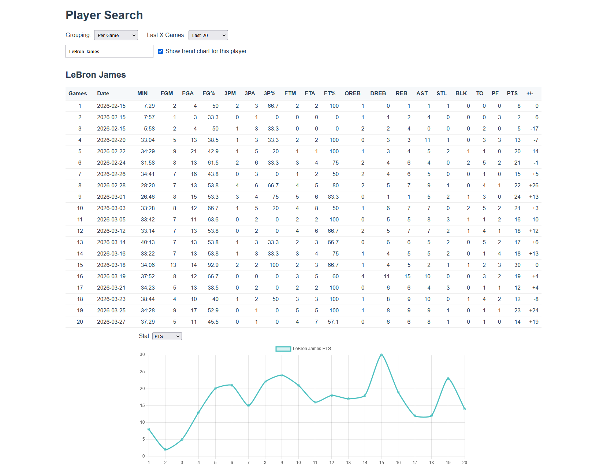
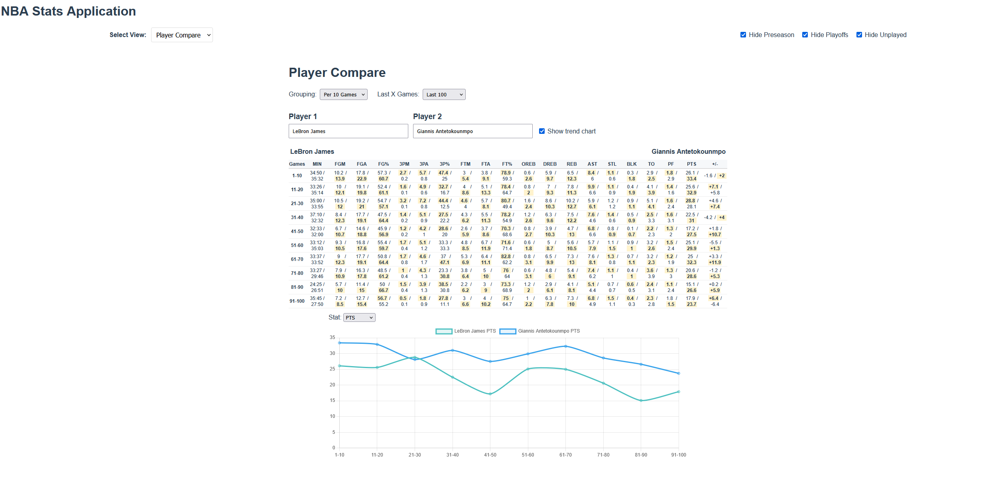
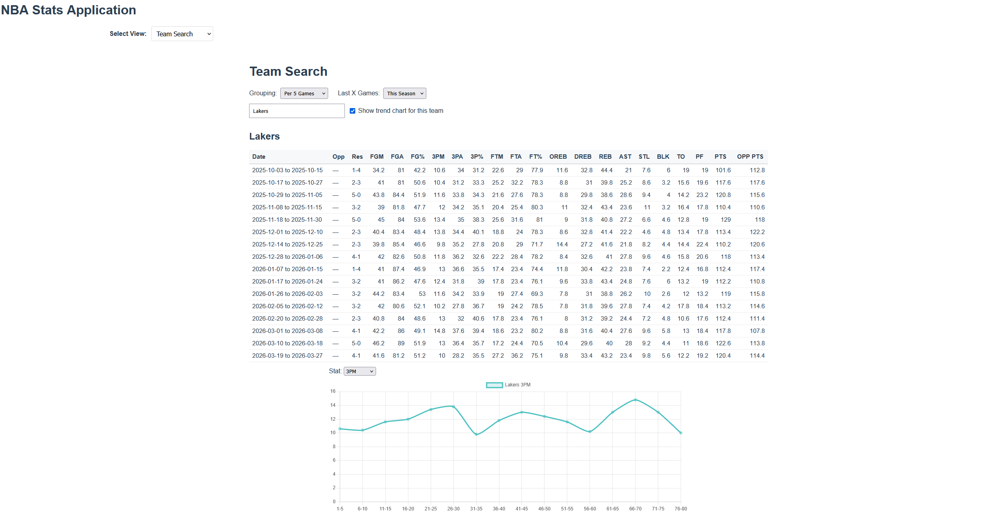
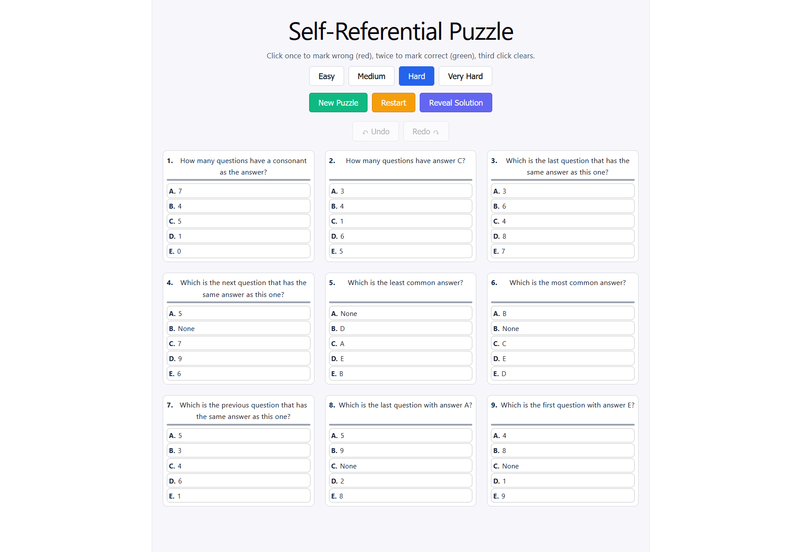
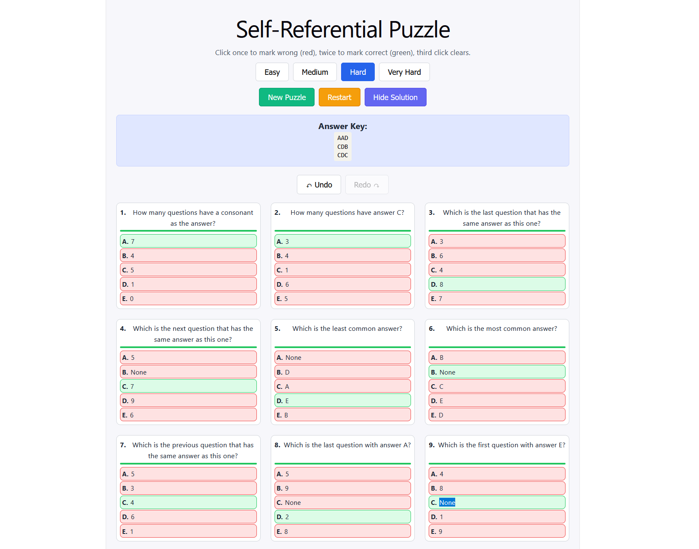
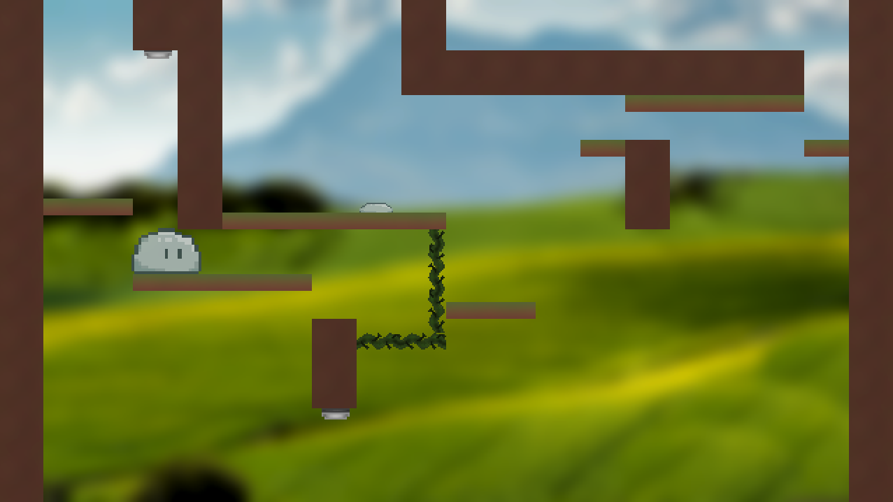
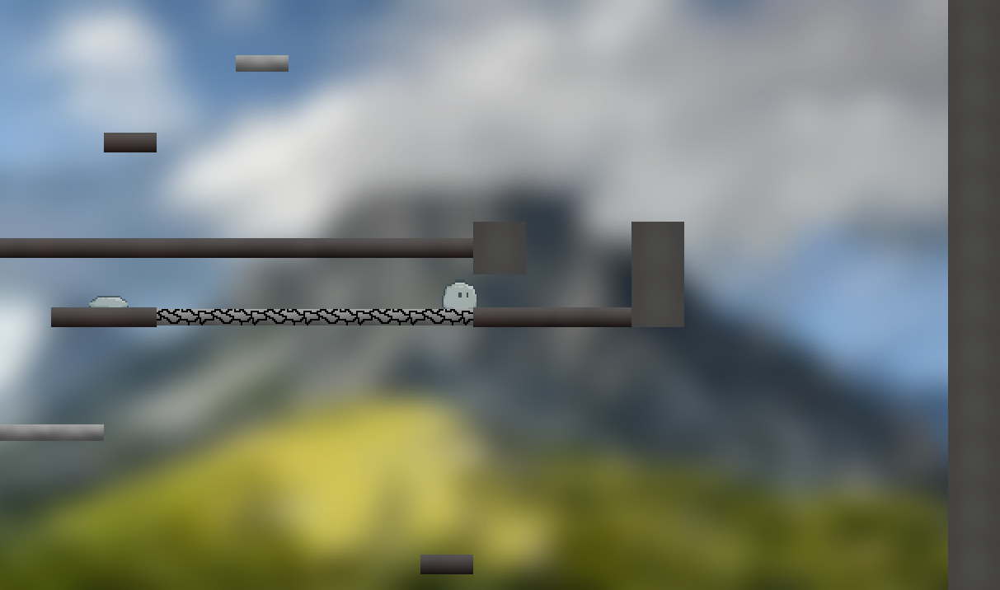
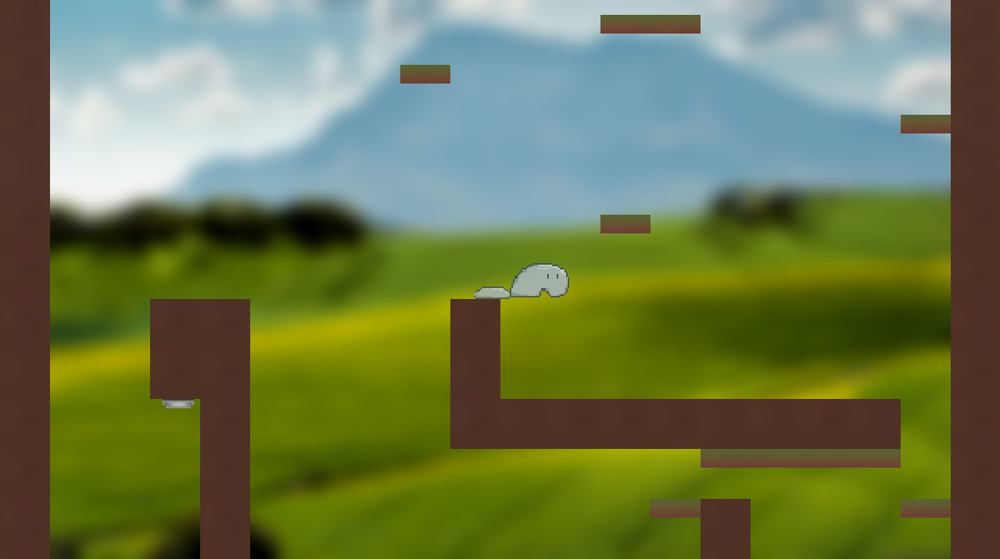

# Chris Wood Portfolio

**Computer Science Graduate**
Developer with experience in C#, Python, C, and Vue.js. Interested in game development, data analysis, and clean software design.

## About this repository

This repository is the portfolio landing page for my GitHub portfolio. It is designed so that:

- `README.md` is the primary portfolio homepage
- individual project README files remain as supporting details
- project repo links are clearly visible

## Technical Skills

- **Languages**: C#, Python, C, JavaScript
- **Frontend**: Vue.js, HTML, CSS
- **Data / Analysis**: Pandas, SQLite, data visualization
- **Game Development**: Unity, 2D gameplay mechanics
- **Concepts**: OOP, data structures, REST APIs, socket programming
- **Tools**: Git, SQL, Flask, npm

---

## Featured Projects

### Slime Climb
A 2D climbing platformer built in Unity where the player controls a slime and gains abilities such as double jump, dash, and projectile shooting.

- **Tech Stack**: Unity, C#
- **Repository**: https://github.com/chriswdev84/slime-climb
- **Details**: See [SimeClimbREADME.md](SimeClimbREADME.md)

---

### Self-Quiz App
A logic puzzle web application built with Vue 3 and Vite.

- **Tech Stack**: Vue.js 3, Vite, JavaScript
- **Repository**: https://github.com/chriswdev84/self-quiz
- **Details**: See [SelfQuizREADME.md](SelfQuizREADME.md)

---

### NBA Stats Application
A web application for searching, comparing, and visualizing NBA player and team statistics.

- **Tech Stack**: Python (Flask), Vue.js 3, SQLite
- **Repository**: https://github.com/chriswdev84/nba-stats-app
- **Details**: See [NBAStatsREADME.md](NBAStatsREADME.md)

---

### FTP-like Client-Server Program
A simple FTP-style client/server program in C demonstrating TCP socket programming, process management, and file transfers.

- **Tech Stack**: C, TCP sockets
- **Details**: See [ftpREADME.md](ftpREADME.md)

---

## Screenshot Gallery

### NBA Stats Application

### Self-Quiz App

### Slime Climb

### FTP Client-Server

- No screenshots are included for this project.

---

## Contact & Resume

- **Email**: ChrisWDev84@gmail.com
- **Resume**: See [resume.md](resume.md)
